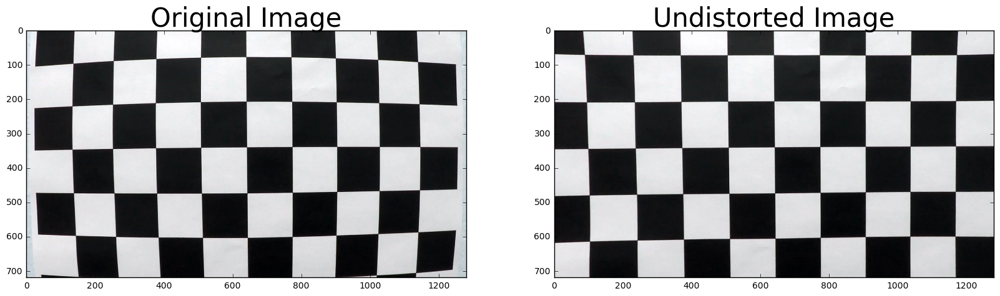
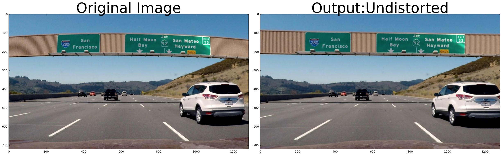
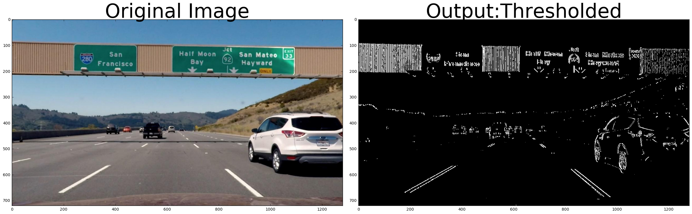
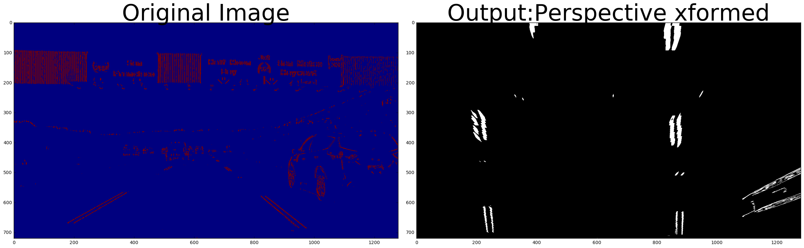

##

## Lane detector 
### Preet Singh
This repository contains my work on Udacity’s Advanced Lane Finding project in their Self-Driving Car program. The problem being solved is to try and detect lane lines in a vehicle-dashboard-cam video of the road. We have to detect the lanes despite issues with lighting, curvature of the road, and background color, among others. Understandably, this requires multiple levels of image processing. The notebook P4-Advanced_Lane-Lines.ipynb  contains the code for an image processing pipeline that takes in a video file, extracts images from it, and processes each image in the following manner:
* Undistorts each image, 
* applies gradient thresholding,
* then a perspective transform, and 
* lastly, detects lane lines by a sliding-window algorithm. 

We fit the detected lane line pixels with a second-order polynomial. The processed image also has text displaying the position of the vehicle and the radius of curvature. The images are then written back into an output video. A test output video, output_project_video.mp4,  is also in the repository. 
 

**Tech stack:** Python 3, OpenCV

### Getting started
The data input is project_video.mp4, which is a dashboard-cam video from a car. Use your own video if you have one. Instructions and code for processing the video through the pipeline are given in the notebook. The rest of this README provides a summary of the pipeline:

### Undistortion of an image
#### First step: Camera Calibration
We correct for lens distortion from the dashboard camera (or similar), but using test images of a chessboard. A chessboard image, due to it’s symmetrical structure, is eminently suited to find distortion coefficients. 

In the code I’ve computed corners of a 9 x 6 chessboard (camera) image (and hence, distorted), computed corners of an idealized chessboard ‘image’ (which is simply a grid) and obtained distortion coefficients (and a camera calibration matrix) by passing in these 2 sets of corresponding points between the actual and idealized ‘image' (using **cv2.calibrateCamera**). We apply this set of coefficients and the matrix, using the **cv2.undistort** function, to an individual actual image to obtain the undistorted version. 

### Example of the undistort function 

### Pipeline steps

I Raw to undistorted : 
I applied the previously saved camera calibration matrix and distortion coefficients to undistorted the image. 
#### Image example 

II Undistorted to thresholded:
I used different ways of Sobel thresholding in logical combination to obtained a final thresholded output. Refer to the section “Different ways of Sobel Thresholding” in the notebook, or images after this section.  

#### Image example

III Combined thresholded to perspective transformed:
I used a manual set of source and destination points to transform the perspective of the image to a bird-eye view. I originally experimented using Harris Corner detection to find corner points, but the results were less than satisfactory. The manual set of points was taken from the example writeup provided with this project. The forums recommended this as well. 

#### Image example

### Sobel Thresholding - 
The images are converted to HLS. The pipeline takes in input from the S channel (saturation gave me the best results, but feel free to experiment with other channels and conversions) and gray channel inputs for combination (along the x-axis, to emphasize detection of vertical-ish lines such as lanes). My defined threshold range is (35,100) for gray and (160,255) for S. Again, feel free to try other parameters and other sobel thresholdings depending on your video input. 

### Post-image processing: Lane-line pixels and fit their positions with a polynomial:
The function **find_lines_v1** performs these functions. I fit to a second-order polynomial and use the sliding-windows method to detect (curved) lane lines. 
#### Output:

### Pipeline code details 
The wrapper pipeline function is img_pipeline.
A. The undistortion, thresholding and perspective transform of the image is done in **preprocess_image**. 
B. Lane-finding by polynomial fit and sliding-window methods are then applied through **find_lane_lines_v1**.
C. We compute radius of curvature from **get_curvature_v2**.
D. The final result is projected on the undistorted image from **warp_lane_lines**. 
E. The variable **result_old** keeps the processed image of a previous frame of the video, and uses this, should the next image be mis-shaped. This is a quick hack for a few problematic frames in my processed video. This is piped into the moviepy image pipeline. 
